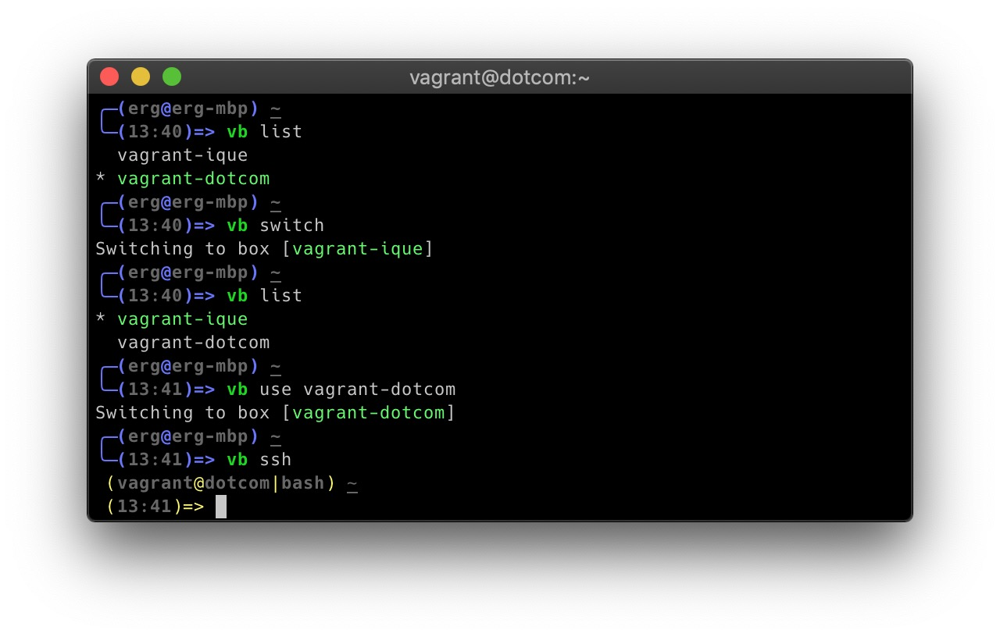

# Vagrant Box Wrapper
A wrapper plugin for [vagrant](https://www.vagrantup.com/) that allows for
calling `vagrant` commands from outside of the box directory. Also, if the user
has multiple `vagrant` boxes, the `switch` parameter switches which box the
commands deal with.

## Table of Contents
- [Screenshot Example](#screenshot-example)
- [Installation](#installation)
  - [Oh-My-Zsh](#oh-my-zsh)
  - [Bash-It](#bash-it)
  - [Vanilla Zsh or Bash](#vanilla-zsh-or-bash)
- [Usage](#usage)
  - [Setup](#setup)
  - [Commands](#commands)
  - [Customization](#customization)

## Screenshot Example


## Installation
### oh-my-zsh
Clone the repository in your `$ZSH_CUSTOM/plugins` directory
```sh
git clone https://github.com/evanthegrayt/vagrant-box-wrapper.git \
  $ZSH_CUSTOM/plugins/vb
```
Then add the plugin to your `$HOME/.zshrc` file in the `plugins` array:
```sh
plugins=(vb) # Obviously, leave your other plugins in the array.
```

### bash-it
Clone the repository in your `$BASH_IT_CUSTOM` directory
```sh
git clone https://github.com/evanthegrayt/vagrant-box-wrapper.git \
  $BASH_IT_CUSTOM/vb
```
Files in this directory that end with `.bash` are automatically sourced, so
there's nothing else to do.

### Vanilla zsh or bash
Clone the repository wherever you like, and source either the `vb.plugin.zsh`
file for `zsh`, or `vb.plugin.bash` file for `bash`, from one of your startup
files, such as `~/.zshrc` or `~/.bashrc`, respectively.

```sh
# Where $INSTALLATION_PATH is the path to where you installed the plugin.
source $INSTALLATION_PATH/vb.plugin.zsh  # in ~/.zshrc
source $INSTALLATION_PATH/vb.plugin.bash # in ~/.bashrc
```

If you're using a version of `zsh`/`bash` that doesn't support the completion
features, or you just don't want to use them, just source the `vb.sh` file
directly.

```sh
source $INSTALLATION_PATH/vb.sh # in either ~/.zshrc or ~/.bashrc
```

## Usage
### Setup
To use this function, you need to add `VB_BOXES_LOCATION=[dir]` and
`VB_BOXES=([BOX NAMES])` as variables in either a startup file, or a file named
`$HOME/.vbrc`.

- `VB_BOX_LOCATION` should be a string set to the path where the boxes are
located.
- `VB_BOXES` should be an array, with each element being a *directory*
that contains a vagrant box.

```sh
# These lines should go in either a startup file, such as `~/.zshrc` or
# `~/.bashrc`, or ~/.vbrc.
VB_BOXES_LOCATION="/path/to/where/boxes/are"
VB_BOXES=(vagrant_box_1 vagrant_box_2 vagrant_box_3)
```

You can view my `.vbrc` file
[here](https://github.com/evanthegrayt/dotfiles/blob/master/dotfiles/vbrc).

### Commands
The `vb` command comes with a few unique arguments.
- `switch` switches the box to the next in the array.
- `list` displays all available boxes, and which is currently being used.
- `cd` changes your current directory to the current box loction.
- `echo` lists the full path to the current box.
- `use [BOX]` skips cycling of boxes and sets current box to `BOX`.
- `-h` gives a brief usage.

Any other argument, `vb` will attempt to forward to the `vagrant` command. Use
this feature to run common `vagrant` commands, such as `up`, `ssh`, `halt`, etc.

### Customization
You can enable/disable colored terminal output, and even change
the colors, by adding the following to your `~/.vbrc` or a startup file.

```sh
VB_COLOR=false               # Default: true. Setting to false disables colors
# The following lines would make the colored output bold.
VB_SUCCESS_COLOR='\e[1;92m'  # Bold green.   Default: '\e[0;92m' (green)
VB_WARNING_COLOR='\e[1;93m'  # Bold yellow.  Default: '\e[0;93m' (yellow)
VB_ERROR_COLOR='\e[1;91m'    # Bold red.     Default: '\e[0;91m' (red)
```

By default, the cache file is `$ZSH_CACHE_DIR/vb.cache` if running `.oh-my-zsh`,
or `~/.cache/vb.cache` if not. To change this, change `VB_CACHE` to a directory
or file name in `~/.vbrc` or a startup file. Note that if pointed to a directory
(either an existing directory, or a string ending in `/`), the file name will
always be named `vb.cache`. If the directory doesn't exist, it will be created
with `mkdir -p`.

```sh
VB_CACHE=$HOME/.vb.cache
```

## Reporting bugs
If you have an idea or find a bug, please [create an
issue](https://github.com/evanthegrayt/vagrant-box-wrapper/issues/new). Just
make sure the topic
doesn't already exist.

If you have an issue with tab-completion, make sure you have completion enabled
for your shell
([bash](https://www.gnu.org/software/bash/manual/html_node/Programmable-Completion.html)
/ [zsh](http://zsh.sourceforge.net/Doc/Release/Completion-System.html)). If,
after reading the manual, you still have problems, feel free to submit an issue.

